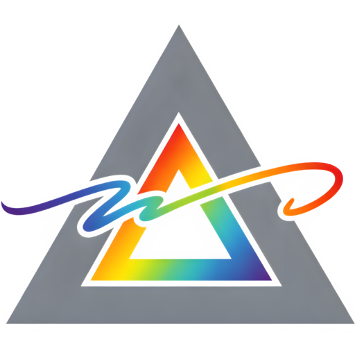

<p align="center">
  
</p>

<h1 align="center">OmniSign</h1>
<p align="center"><strong>Sign, validate, and future-proof your PDF documents — on any platform.</strong></p>

<div align="center">

[](https://github.com/pizavo/omnisign/actions/workflows/ci-cli.yml)
[](https://github.com/pizavo/omnisign/actions/workflows/ci-desktop.yml)
[](https://github.com/pizavo/omnisign/actions/workflows/ci-server.yml)
[](https://github.com/pizavo/omnisign/actions/workflows/ci-web.yml)
[](https://github.com/pizavo/omnisign/actions/workflows/qodana_code_quality.yml)

[](https://kotlinlang.org/)
[](https://github.com/JetBrains/compose-multiplatform)
[](https://ec.europa.eu/digital-building-blocks/DSS/webapp-demo/doc/dss-documentation.html)
[](LICENSE.md)
[](https://pizavo.github.io/omnisign/)

</div>

---

## What Is OmniSign?

OmniSign is a free, open-source application for **digitally signing PDF documents** in a way that
is legally recognized across the European Union and beyond. Whether you need to sign a contract,
validate a diploma, or ensure that archived documents remain trustworthy for decades, OmniSign
has you covered.

Under the hood, OmniSign is powered by the
[EU Digital Signature Service (DSS)](https://ec.europa.eu/digital-building-blocks/DSS/webapp-demo/doc/dss-documentation.html)
library — the same technology used by EU member states — and fully supports
**PAdES BASELINE B / B-T / B-LT / B-LTA** signature levels, including PDF/A-3b documents.

### Who Is It For?

| Audience                              | Use Case                                                                                                                     |
|---------------------------------------|------------------------------------------------------------------------------------------------------------------------------|
| 👩‍🎓 **Students & academics**        | Sign and validate qualification theses, research papers, or assignments.                                                     |
| 🏛️ **Universities & institutions**   | Deploy a self-hosted server to offer signing and validation to employees and students, with automatic long-term archival.    |
| 👨‍💻 **Developers & sysadmins**      | Integrate digital signatures into CI/CD pipelines and scripts using the CLI or server API with machine-readable JSON output. |
| 📄 **Anyone who needs to sign a PDF** | Use the desktop or web app with a friendly graphical interface — no command-line knowledge required.                         |

### How Does It Work?

A digital signature proves **who** signed a document and that **nothing has changed** since.
OmniSign supports four levels of signature strength, each building on the previous one:

| Level                          | What It Adds            | Why It Matters                                                                                                   |
|--------------------------------|-------------------------|------------------------------------------------------------------------------------------------------------------|
| **B** (Basic)                  | Cryptographic signature | Proves authorship and document integrity.                                                                        |
| **B-T** (Timestamp)            | + Trusted timestamp     | Proves the signature existed at a specific point in time, even if the certificate expires later.                 |
| **B-LT** (Long-Term)           | + Revocation data       | Embeds all the information needed to verify the signature offline, long after the certificate or CA goes away.   |
| **B-LTA** (Long-Term Archival) | + Archival timestamp    | Adds a second timestamp that protects everything above. Can be renewed indefinitely for true digital continuity. |

> 💡 **In practice:** Sign at B-T or higher if you want the signature to remain verifiable
> after your certificate expires. Choose B-LTA for documents that must be trustworthy for
> years or decades (theses, legal contracts, archival records).

## Features

|     | Feature                           | What It Does                                                                                                                                                                                                           |
|-----|-----------------------------------|------------------------------------------------------------------------------------------------------------------------------------------------------------------------------------------------------------------------|
| ✍️  | **Signing**                       | Sign PDF documents using certificates stored in software files (PKCS #12), hardware tokens (PKCS #11, including qualified smart cards), the Windows Certificate Store, or the macOS Keychain.                          |
| ✅   | **Validation**                    | Verify that a signed PDF is authentic and untampered. Checks against the EU Trusted Lists (eIDAS / LOTL), your own custom trusted lists, or standalone certificate chains — with full CRL and OCSP revocation support. |
| 🕑  | **Timestamping**                  | Upgrade an existing signature step by step — from B-B → B-T → B-LT → B-LTA — by adding RFC 3161 timestamps and revocation data.                                                                                        |
| 🗄️ | **Archival (Digital Continuity)** | Keep B-LTA documents valid indefinitely. OmniSign can automatically re-timestamp them before archival timestamps expire, scheduled by your operating system so you never have to think about it.                       |
| 📜  | **Custom Trusted Lists**          | Build and register your own ETSI-compliant Trusted Lists for environments outside the EU trust framework (e.g., university-internal PKI).                                                                              |
| 🔐  | **Configurable Algorithms**       | SHA-256, SHA-384, and SHA-512 out of the box, plus support for Whirlpool, RIPEMD-160, and future post-quantum algorithms. Per-algorithm expiration management follows ETSI TS 119 312.                                 |
| 👤  | **Profiles**                      | Save named configuration profiles for different contexts — personal, corporate, university — and switch between them instantly.                                                                                        |
| 🤖  | **JSON Output**                   | Machine-readable JSON mode makes it easy to script signing and validation into automated workflows.                                                                                                                    |

## Platforms

OmniSign runs everywhere you need it — from a terminal to a full graphical application,
on your machine or on a shared server.

| Platform    | Module                               | Technology             | Description                                                                                                              |
|-------------|--------------------------------------|------------------------|--------------------------------------------------------------------------------------------------------------------------|
| **CLI**     | [`cli`](cli/README.md)               | Kotlin/JVM             | Full-featured command line for scripting and power users. Ships as a fat JAR and native installers (MSI, DEB, RPM, PKG). |
| **Desktop** | [`composeApp`](composeApp/README.md) | Compose Multiplatform  | Graphical app for Linux, Windows, and macOS with PDF preview, drag-and-drop, and a settings UI.                          |
| **Server**  | `server`                             | Ktor (Kotlin/JVM)      | HTTP API for institutional deployments — sign, validate, and archive from any client.                                    |
| **Web**     | [`composeApp`](composeApp/README.md) | Compose for Web (Wasm) | Browser-based PDF viewer and validation UI (signing operations require the server back-end).                             |

## Project Structure

```
omnisign/
├── shared/         Multiplatform core — domain models, use cases, DSS integration
├── cli/            Command-line interface (fat JAR + native installers)
├── composeApp/     Compose Multiplatform UI — desktop (JVM) and web (Wasm) targets
├── server/         Ktor HTTP server
├── docs/           Docusaurus user documentation site
└── gradle/         Version catalog and Gradle wrapper
```

## Quick Start

### Prerequisites

| Requirement                    | Notes                                                                                                                                                                            |
|--------------------------------|----------------------------------------------------------------------------------------------------------------------------------------------------------------------------------|
| **JDK 25+**                    | Required by the `shared` module.                                                                                                                                                 |
| **JetBrains Runtime (JBR) 25** | Required only for the **desktop** target. Install via IntelliJ IDEA Gradle JDK settings or download from [JBR releases](https://github.com/JetBrains/JetBrainsRuntime/releases). |
| **Gradle**                     | Wrapper included — no global install needed.                                                                                                                                     |

### CLI

```shell
# Build the fat JAR
./gradlew :cli:shadowJar                                    # Linux / macOS
.\gradlew.bat :cli:shadowJar                                # Windows

# Run it
java -jar cli/build/libs/omnisign-<version>.jar --help

# Or run directly via Gradle
./gradlew :cli:run --args="--help"
```

Native installers (MSI, DEB, RPM, PKG, DMG) are also available — see the
[CLI README](cli/README.md) for the full command reference, installer packages, and usage examples.

### Desktop

```shell
./gradlew :composeApp:run                                   # Linux / macOS
.\gradlew.bat :composeApp:run                               # Windows
```

See the [Compose UI README](composeApp/README.md) for native distribution packaging,
the web target, architecture details, and feature parity.

### Server

```shell
./gradlew :server:run                                       # Linux / macOS
.\gradlew.bat :server:run                                   # Windows
```

### Web (Wasm)

```shell
./gradlew :composeApp:wasmJsBrowserDevelopmentRun            # Linux / macOS
.\gradlew.bat :composeApp:wasmJsBrowserDevelopmentRun        # Windows
```

A local development server starts and opens the app in the default browser.

## Documentation

| Resource                                     | Location                                                                |
|----------------------------------------------|-------------------------------------------------------------------------|
| **User guides** (CLI, Desktop, Server & Web) | [`docs/`](docs/) — Docusaurus site, run with `npm start` inside `docs/` |
| **API reference** (KDoc)                     | Generated via `./gradlew :dokkaGenerate` → `build/dokka/html/`          |
| **CLI command reference**                    | [`cli/README.md`](cli/README.md)                                        |
| **Desktop & Web details**                    | [`composeApp/README.md`](composeApp/README.md)                          |

## Testing

The project uses **[Kotest 6](https://kotest.io/)** (FunSpec style),
**[MockK](https://mockk.io/)**, and
**[Arrow Kotest matchers](https://arrow-kt.io/learn/quickstart/#kotest)**.

```shell
./gradlew :shared:jvmTest          # Shared module (domain + DSS integration)
./gradlew :cli:test                # CLI command tests
./gradlew :server:test             # Server route tests
./gradlew :composeApp:jvmTest      # Desktop ViewModel tests
```

## Key Libraries

| Library                                                                                               | Purpose                                                        |
|-------------------------------------------------------------------------------------------------------|----------------------------------------------------------------|
| [EU DSS 6.3](https://ec.europa.eu/digital-building-blocks/DSS/webapp-demo/doc/dss-documentation.html) | PAdES signing, validation, timestamping, trusted list handling |
| [Kotlin Multiplatform](https://kotlinlang.org/docs/multiplatform.html)                                | Shared business logic across JVM, Wasm, and future targets     |
| [Compose Multiplatform](https://github.com/JetBrains/compose-multiplatform)                           | Shared declarative UI for desktop and web                      |
| [Ktor](https://ktor.io/)                                                                              | HTTP server                                                    |
| [Clikt](https://ajalt.github.io/clikt/)                                                               | CLI argument parsing                                           |
| [Koin](https://insert-koin.io/)                                                                       | Dependency injection                                           |
| [Arrow](https://arrow-kt.io/)                                                                         | Functional error handling (`Either`-based `OperationResult`)   |
| [Kotest](https://kotest.io/) + [MockK](https://mockk.io/)                                             | Testing and mocking                                            |
| [kotlinx.serialization](https://github.com/Kotlin/kotlinx.serialization)                              | JSON configuration persistence                                 |
| [Jackson](https://github.com/FasterXML/jackson)                                                       | YAML / XML config export & import                              |
| [Apache PDFBox](https://pdfbox.apache.org/)                                                           | PDF page rendering (desktop)                                   |
| [FileKit](https://github.com/nicholosP/filekit)                                                       | Cross-platform file picker dialogs                             |

## License

This project is licensed under the
[GNU Affero General Public License v3.0 or later](LICENSE.md) (AGPL-3.0-or-later).

Copyright © 2026 [Pizavo](mailto:pizavo@gmail.com).
